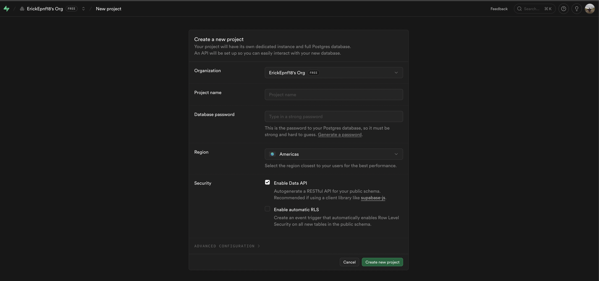
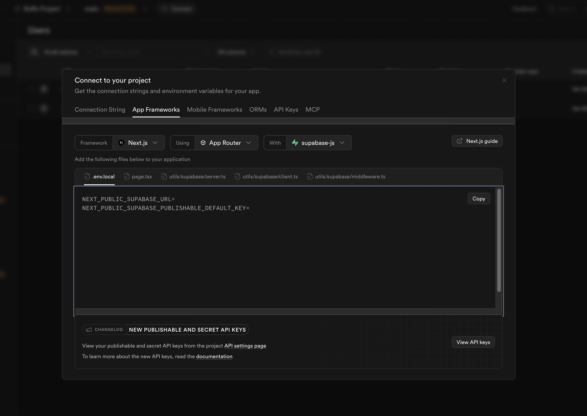
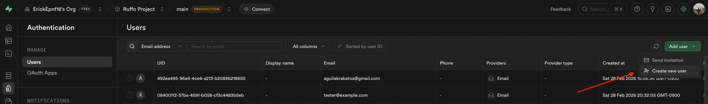
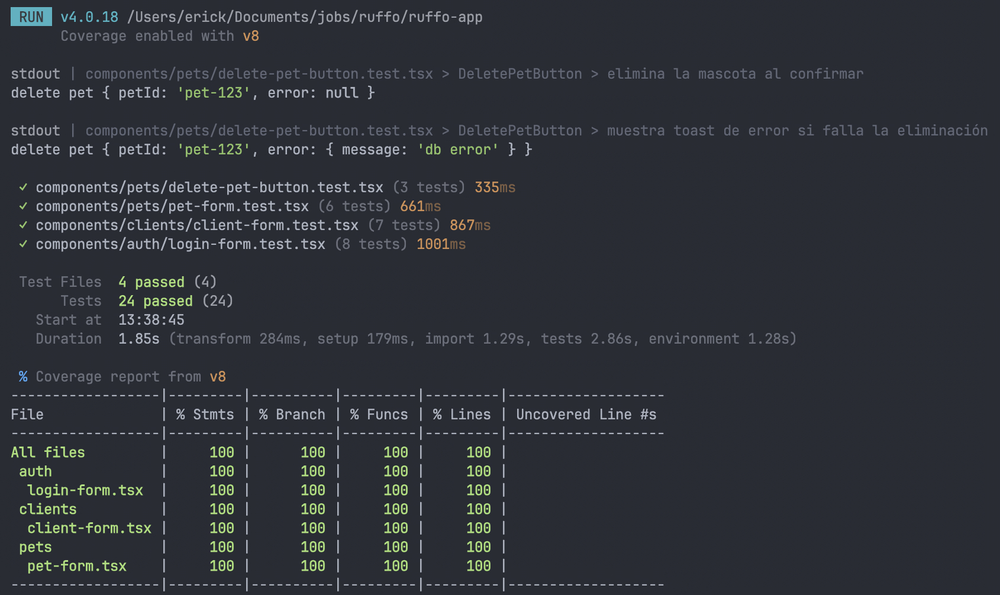
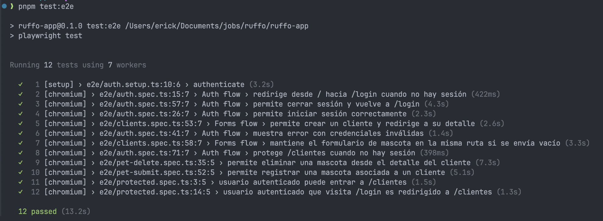

# Ruffo App — Mini módulo de Clientes y Mascotas

Aplicación desarrollada con **Next.js (App Router)**, **TypeScript**, **Supabase** y **shadcn/ui** para simular un mini-módulo funcional de gestión de clientes y mascotas para una plataforma SaaS de peluquerías caninas.


- **Repositorio:** [ruffo-app](https://github.com/erickfy/ruffo-app)
- **Deploy :** [ruffo-app-one.vercel.app](https://ruffo-app-one.vercel.app/)
- **Usuarios de prueba:**
  - `tester@example.com`
    - `SecureFlame17`
  - `aguilakrakatoa@gmail.com`
    - `Bmxextremo17.`

---

## Objetivo

Construir un módulo funcional que permita:

- autenticación con Supabase Auth
- listado de clientes
- registro de clientes
- detalle del cliente
- registro de mascotas asociadas

---

## Stack utilizado

- **Next.js 16** (compatible con el requerimiento `Next.js 14+`)
- **React 19**
- **TypeScript**
- **Supabase**
- **@supabase/ssr**
- **shadcn/ui**
- **Tailwind CSS**

---

## Requisitos previos

Antes de ejecutar el proyecto localmente necesitas:

- Node.js 20+
- pnpm
- una cuenta en Supabase
- un proyecto de Supabase creado

---

## Instalación local

```bash
git clone TU_REPOSITORIO
cd ruffo-app
pnpm install
```

Crear el archivo `.env.local` a partir de `.env.example`:

```bash
cp .env.example .env.local
```

Luego iniciar el proyecto:

```bash
pnpm dev
```

La aplicación estará disponible en:

```bash
http://localhost:3000
```

---

## Variables de entorno

Este proyecto utiliza las siguientes variables:

```env
NEXT_PUBLIC_SUPABASE_URL=
NEXT_PUBLIC_SUPABASE_PUBLISHABLE_KEY=

<!-- Para e2e -->
E2E_LOGIN_EMAIL=tester@example.com
E2E_LOGIN_PASSWORD=SecureFlame17
```

---

## Configuración de Supabase

### 1. Crear un proyecto en Supabase

Crear un proyecto desde el dashboard de Supabase.



### 2. Obtener credenciales

Desde **Connect** o **Settings > API**, copiar:

- `Project URL`
- `Publishable key`

Y pegarlas en `.env.local`.



### 3. Crear usuario de prueba

Desde **Authentication > Users**, crear manualmente un usuario de prueba con email y contraseña.



---

## Usuario de prueba

> Reemplazar con las credenciales reales configuradas en Supabase.

- **Email:** `usuario_prueba@correo.com`
- **Contraseña:** `TuPassword123*`

---

## SQL para crear las tablas

```sql
create extension if not exists pgcrypto;

create table if not exists public.clients (
  id uuid primary key default gen_random_uuid(),
  full_name text not null,
  phone text not null,
  email text,
  notes text,
  created_at timestamptz not null default now()
);

create table if not exists public.pets (
  id uuid primary key default gen_random_uuid(),
  client_id uuid not null references public.clients(id) on delete cascade,
  name text not null,
  species text not null check (species in ('canino', 'felino', 'otro')),
  breed text,
  behavior_notes text,
  created_at timestamptz not null default now()
);
```

---

## RLS y policies

```sql
alter table public.clients enable row level security;
alter table public.pets enable row level security;

create policy "authenticated users can do everything on clients"
on public.clients
for all
to authenticated
using (true)
with check (true);

create policy "authenticated users can do everything on pets"
on public.pets
for all
to authenticated
using (true)
with check (true);
```

---

## Datos de prueba (seed manual)

```sql
WITH nuevos_clientes AS (
  INSERT INTO public.clients (full_name, phone, email, notes)
  VALUES
    ('Carlos Andrade', '0993334444', 'c.andrade@email.com', 'Trae a sus perros siempre los fines de semana'),
    ('Elena Viteri', '0985556666', 'elena.v@correo.ec', 'Rescata gatos, cliente muy paciente'),
    ('Roberto Gómez', '0977778888', 'roberto_g@servicios.com', 'Prefiere factura física'),
    ('Lucía Méndez', '0961112222', 'lucia.mendez@outlook.com', 'Nueva en el sector'),
    ('Fernando Caicedo', '0954443333', 'fer_caicedo@gmail.com', 'A veces olvida las citas, llamar un día antes'),
    ('María Pérez', '0991111111', 'maria@example.com', 'Cliente frecuente'),
    ('Juan Torres', '0982222222', 'juan@example.com', 'Prefiere contacto por WhatsApp'),
    ('Andrea Salazar', '0971234567', 'andrea.salazar@mail.com', 'Muy puntual en sus citas'),
    ('Diego Ponce', '0967654321', 'diego.ponce@gmail.com', 'Tiene mascotas nerviosas'),
    ('Sofía Cedeño', '0959876543', 'sofia.cedeno@correo.com', 'Solicita recordatorio por llamada'),
    ('Miguel Herrera', '0944567890', 'miguel.herrera@outlook.com', 'Cliente nuevo'),
    ('Valentina Ríos', '0931122334', 'valentina.rios@email.com', 'Le interesa servicio frecuente')
  RETURNING id, full_name
)

INSERT INTO public.pets (client_id, name, species, breed, behavior_notes)
VALUES
  ((SELECT id FROM nuevos_clientes WHERE full_name = 'Carlos Andrade'), 'Thor', 'canino', 'Golden Retriever', 'Muy juguetón pero babea mucho'),
  ((SELECT id FROM nuevos_clientes WHERE full_name = 'Carlos Andrade'), 'Kiara', 'canino', 'Pastor Alemán', 'Protectora, no le gusta que le toquen las patas'),

  ((SELECT id FROM nuevos_clientes WHERE full_name = 'Elena Viteri'), 'Simba', 'felino', 'Persa', 'Le encanta el cepillado, muy dócil'),
  ((SELECT id FROM nuevos_clientes WHERE full_name = 'Elena Viteri'), 'Nala', 'felino', 'Mestizo', 'Asustadiza con ruidos metálicos'),
  ((SELECT id FROM nuevos_clientes WHERE full_name = 'Elena Viteri'), 'Pelusa', 'felino', 'Siamés', 'Maúlla mucho durante el baño'),

  ((SELECT id FROM nuevos_clientes WHERE full_name = 'Roberto Gómez'), 'Bruno', 'canino', 'Bulldog Francés', 'Problemas respiratorios, no usar collares apretados'),

  ((SELECT id FROM nuevos_clientes WHERE full_name = 'Lucía Méndez'), 'Rocky', 'canino', 'Schnauzer', 'Ladra mucho a otros perros en sala de espera'),

  ((SELECT id FROM nuevos_clientes WHERE full_name = 'Fernando Caicedo'), 'Coco', 'otro', 'Conejo Enano', 'Muy inquieto, cuidado al sacarlo de la jaula'),

  ((SELECT id FROM nuevos_clientes WHERE full_name = 'María Pérez'), 'Luna', 'canino', 'Poodle', 'Nerviosa al inicio'),
  ((SELECT id FROM nuevos_clientes WHERE full_name = 'Juan Torres'), 'Milo', 'felino', 'Mestizo', 'Tranquilo'),

  ((SELECT id FROM nuevos_clientes WHERE full_name = 'Andrea Salazar'), 'Max', 'canino', 'Labrador', 'Muy sociable con otros perros'),
  ((SELECT id FROM nuevos_clientes WHERE full_name = 'Andrea Salazar'), 'Toby', 'canino', 'Beagle', 'Le cuesta quedarse quieto'),

  ((SELECT id FROM nuevos_clientes WHERE full_name = 'Diego Ponce'), 'Lola', 'felino', 'Angora', 'No tolera secadora cerca'),
  ((SELECT id FROM nuevos_clientes WHERE full_name = 'Sofía Cedeño'), 'Canela', 'canino', 'Cocker Spaniel', 'Muy dócil durante el baño'),

  ((SELECT id FROM nuevos_clientes WHERE full_name = 'Miguel Herrera'), 'Bongo', 'otro', 'Cobayo', 'Sensible a ruidos fuertes'),
  ((SELECT id FROM nuevos_clientes WHERE full_name = 'Valentina Ríos'), 'Mía', 'canino', 'Shih Tzu', 'Muy tranquila, ideal para grooming');
```

---

## Rutas principales

- `/login` → inicio de sesión
- `/clientes` → listado de clientes
- `/clientes/nuevo` → registro de cliente
- `/clientes/[id]` → detalle del cliente y sus mascotas
- `/clientes/[id]/mascotas/nuevo` → registro de mascota

---

## Decisiones técnicas

### 1. Supabase como backend principal

Se utilizó Supabase para autenticación, base de datos PostgreSQL y manejo de seguridad con RLS, manteniendo el stack alineado al enunciado.

### 2. Separación entre cliente browser y cliente server

Se usó `@supabase/ssr` para manejar correctamente autenticación en App Router, tanto en componentes del servidor como en componentes cliente.

### 3. Formularios simples con Client Components

Los formularios se implementaron como Client Components para simplificar el flujo de inserción y validación básica, priorizando claridad y velocidad de desarrollo.

### 4. Paginación en cliente

Se eligió paginación en cliente porque el volumen de datos de la prueba es pequeño y permite una implementación simple, legible y suficiente para el escenario técnico.

### 5. Buscador visual con dropdown

Se implementó un buscador con dropdown para mejorar la experiencia de uso y facilitar la selección de clientes por nombre, teléfono o email.

---

## Tests

Se implementaron pruebas automatizadas para validar tanto la lógica de formularios como los flujos reales de autenticación y navegación protegida.

### Tests unitarios

Se utilizaron:

- **Vitest**
- **React Testing Library**
- **@testing-library/user-event**

Los tests unitarios cubren los siguientes componentes:

- `components/pets/delete-pet-button.test.tsx`
- `components/pets/pet-form.test.tsx`
- `components/clients/client-form.test.tsx`
- `components/auth/login-form.test.tsx`

Escenarios cubiertos:

- render correcto de formularios
- escritura y actualización de campos
- validaciones con `zod` + `react-hook-form`
- sanitización de datos antes del submit
- manejo de errores de servidor
- visualización de mensajes de error
- estados de loading
- redirecciones posteriores a acciones exitosas
- toasts de éxito y error

### Cobertura

Para ejecutar la cobertura:

```bash
pnpm test:coverage
```

Resultado actual de cobertura:

- **Statements:** 100%
- **Branches:** 100%
- **Functions:** 100%
- **Lines:** 100%



### Tests E2E

Se implementaron pruebas end-to-end con **Playwright** para validar los flujos reales de la aplicación:

- autenticación completa (login, logout, credenciales inválidas, formularios)
- protección de rutas y redirecciones
- creación de clientes
- registro de mascotas asociadas a clientes
- eliminación de mascotas

Para usar los tests E2E, debes agregar las siguientes variables de entorno:

```env
E2E_LOGIN_EMAIL=tester@example.com
E2E_LOGIN_PASSWORD=SecureFlame17
```

Para ejecutar los tests E2E:

```bash
pnpm test:e2e
```



### Resultado actual

Estado actual de pruebas:

- **Unit tests:** 24/24 passing
- **E2E tests:** 12/12 passing

### Nota técnica

Se eligió combinar:

- **tests unitarios** para validar la lógica y comportamiento del componente de login
- **tests E2E** para validar el flujo real de autenticación y redirecciones en App Router

Esto resulta especialmente útil en Next.js con Server Components, donde el comportamiento completo de navegación y sesión se valida mejor mediante pruebas end-to-end.

## Modelos IA utilizados

- **Chat:** OpenAI GPT-5.2
- **Gemini:** Google Gemini 3.1

## Qué mejoraría con más tiempo

- edición de clientes y mascotas
- paginación y búsqueda directamente desde Supabase
- internacionalización i18n
- mejores estados de carga y skeletons
- filtros adicionales por fecha o cantidad de mascotas
